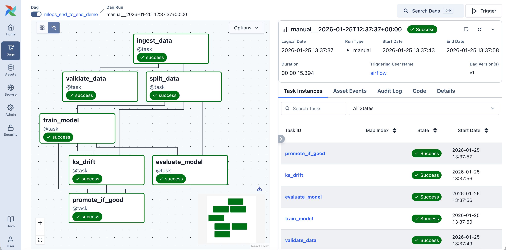
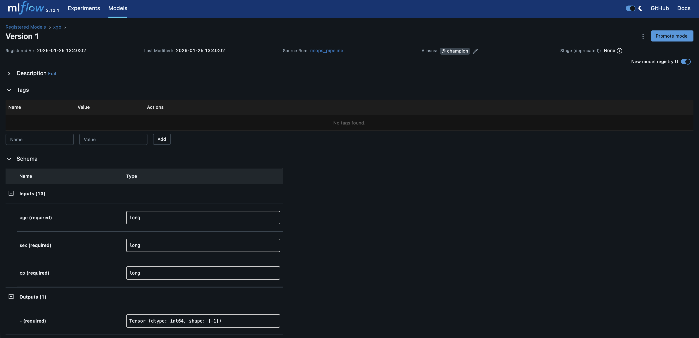
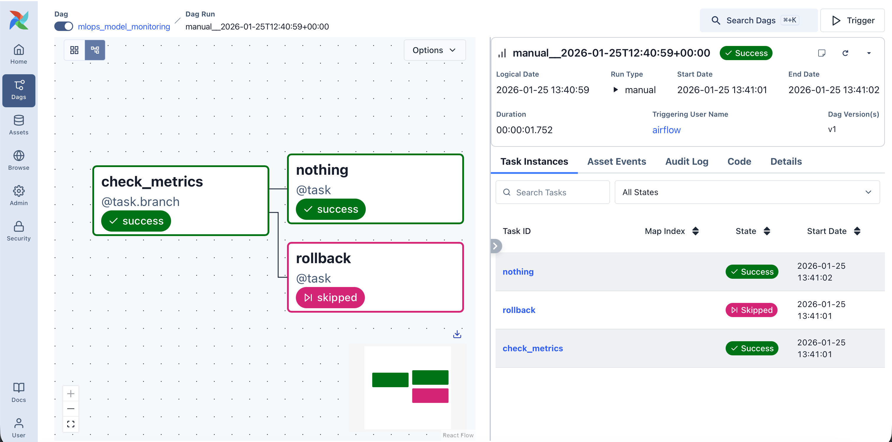
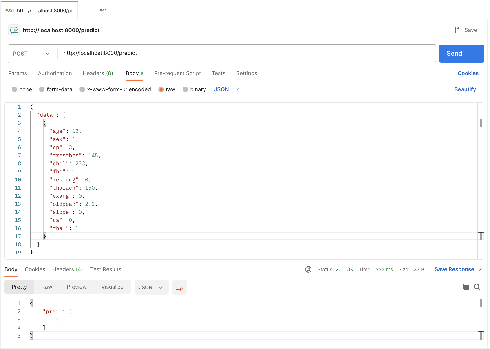

# pro-mlops-s30244
## Description
This project implements an end-to-end MLOps pipeline for training, validating, deploying and monitoring a machine learning model using:
- Apache Airflow - orchestration
- MLflow - model registry
- FastAPI - model deployment

## Dataset
Source: https://raw.githubusercontent.com/nmiuddin/UCI-Heart-Disease-Dataset/refs/heads/master/data/heart-disease-UCI.csv
Size: 300 entries
Description: the dataset contains records of clinical attributes of patients as well as their diagnosis (presence/absence of heart disease)

## Pipeline
**1. Data ingestion**

The dataset is downloaded and saved as a CSV file.

**2. Data validation**

The raw dataset is validated.
Validation includes:

- Presence of required columns
- Ensures no missing values

**3. Train/test split**

- Stratified split using scikit-learn
- Stores datasets as .parquet files

**4. Model training**

- Trains a XGBoost classifier
- Logs hyperparameters, feature importance, model artifacts
- Registers a model in MLflow Registry

**5. Data drift detection**
- Uses KS test (compares train and test distributions)
- Logs draft metrics to MLflow

**6. Model evaluation**
- Evaluates model accuracy
- Logs metrics to MLflow

**7. Model promotion**
Promotes a model if accuracy >= threshold and no data drift detected

## Model monitoring (Rollback DAG)
- Runs daily
- Checks current model accuracy
- Rollbacks previous champion model if accuracy < threshold

## FastAPI deployment
### Endpoint
**POST** /predict  
Request body:
```
{
  "data": [
    {
      "age": 62,
      "sex": 1,
      "cp": 3,
      "trestbps": 145,
      "chol": 233,
      "fbs": 1,
      "restecg": 0,
      "thalach": 150,
      "exang": 0,
      "oldpeak": 2.3,
      "slope": 0,
      "ca": 0,
      "thal": 1
    }
  ]
}
```

Response:
```
{
    "pred": [
        1
    ]
}
```

## Setup
### 1. Clone the repository
```
git clone git@github.com:PROJ-D-2024/pro-mlops-s30244.git
```

### 2. Create .env file in project root
```
AIRFLOW_UID=50000

PROJECT_NAME=mlops_demo

DATA_SOURCE=https://raw.githubusercontent.com/nmiuddin/UCI-Heart-Disease-Dataset/refs/heads/master/data/heart-disease-UCI.csv

DATA_SUBDIR=data
ARTIFACTS_SUBDIR=artifacts
MLRUNS_SUBDIR=mlruns

MLFLOW_EXPERIMENT_NAME=airflow-mlops-demo
MLFLOW_EXPERIMENT_URI=http://mlflow:5050

PRODUCTION_ALIAS=champion
PREVIOUS_ALIAS=previous
ROLLBACKED_ALIAS=rollbacked
```

### 3. Start services
```
docker compose up -d
```
**Services:**
- Airflow UI: http://localhost:8080
- MLflow UI: http://localhost:5050
- FastAPI: http://localhost:8000

### 4. Run training pipeline (*Manually*)
Go to http://localhost:8080/dags/mlops_end_to_end_demo.

Click the "Trigger" button (Single Run).

**Execution result:**


**Trained model:**


### 5. Run monitoring pipeline (*Manually*)
Go to http://localhost:8080/dags/mlops_model_monitoring.

Click the "Trigger" button (Single Run).

**Execution result:**


### 6. Access deployed model
Send request to http://localhost:8000  
**POST** /predict  
Request body:
```
{
  "data": [
    {
      "age": 62,
      "sex": 1,
      "cp": 3,
      "trestbps": 145,
      "chol": 233,
      "fbs": 1,
      "restecg": 0,
      "thalach": 150,
      "exang": 0,
      "oldpeak": 2.3,
      "slope": 0,
      "ca": 0,
      "thal": 1
    }
  ]
}
```

**Response:**

